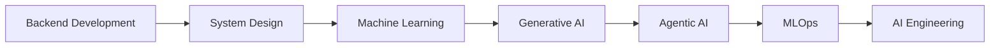

  

<h1 align="center">Pranay Bhoir</h1>

<b>Backend Developer • AI/ML Engineer in Progress • FastAPI • Node.js</b>

Building production-grade AI systems, scalable backends, and intelligent agents.

  

  
  
  
  

  
  
  

---

## 🧬 About Me

- **Name:** Pranay Bhoir
- **Roles:** Backend Developer • AI/ML Engineer in Progress • FastAPI Developer • Node.js Developer
- **Current Goal:** Become a production-grade AI Engineer capable of building scalable backend systems, intelligent agents, RAG applications, and ML-powered products.

### ⚙️ Core Technologies

  
  
  
  
  
  
  
  
  
  

### 🧠 AI Stack

  
  
  
  
  
  
  
  
  

---

## 🧪 Developer Dashboard (Terminal View)

<pre>
┌─[ PRANAY@NEURALOPS ]─[~/ai-dashboard]
│
├─ 🧭 Current Focus     : Building scalable AI backends + RAG systems
├─ 📚 Learning Roadmap  : System Design → MLOps → Agentic AI → Production ML
├─ 🧪 System Status     : [ONLINE] | Latency: 42ms | Agents: 08 | Uptime: 99.98%
├─ 🛰️ Mission Statement : "Engineer intelligence that ships, scales, and serves."
└─ 🧰 Tech Arsenal      : Python · FastAPI · Node.js · PostgreSQL · Docker · Redis
</pre>

### 📈 Learning Roadmap (Live Progress)

- 
- 
- 
- 
- 
- 

---

## 🚀 Featured Projects

<table>
  <tr>
    <td width="33%" valign="top">
      <h3 align="center">NeuralOps AI</h3>
      

        
      

      
Production-grade AI platform for agents, RAG pipelines, monitoring, LLM workflows, and enterprise architecture.

      

        
        
        
        
        
      

      

        
        
        
      

      

        
      

    </td>
    <td width="33%" valign="top">
      <h3 align="center">AIML Department Website</h3>
      

        
      

      
Academic department platform with admin dashboard, events, academics, notices, and dynamic content management.

      

        
        
        
        
      

      

        
        
        
      

      

        
      

    </td>
    <td width="33%" valign="top">
      <h3 align="center">Kharka Mumbai</h3>
      

        
      

      
Intelligent tourism platform for discovering places, experiences, and travel insights around Mumbai.

      

        
        
        
      

      

        
        
        
      

      

        
      

    </td>
  </tr>
</table>

---

## 🧭 AI Engineer Journey

  

---

## 📊 GitHub Analytics

  
  

  
  

  

  

  

---

## ⚡ Cool Dynamic Features

| Dynamic Module | Status |
| --- | --- |
| Matrix Terminal | ✅ Online |
| Activity Graph | ✅ Streaming |
| WakaTime Sync | ✅ Live |
| Agent Telemetry | ✅ Observability Enabled |

<pre>
▁ ▂ ▃ ▄ ▅ ▆ ▇ █  MATRIX FEED ACTIVE  █ ▇ ▆ ▅ ▄ ▃ ▂ ▁
NODE-01 ▸ Agents: ████████░░ 80%
NODE-02 ▸ RAG Ops: ███████░░░ 70%
NODE-03 ▸ LLM Eval: ██████░░░░ 60%
NODE-04 ▸ MLOps: ████░░░░░░ 40%
</pre>

---

  <h2>BUILD • SCALE • AUTOMATE • INTELLIGENCE</h2>
  

