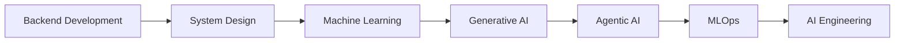

<div align="center">


</div>

---

<h2 align="center">🧠 AI Engineering Command Center</h2>

```bash
┌─────────────────────────────────────────────────────────────┐
│ DEV_PROFILE      : Pranay Bhoir                             │
│ PRIMARY_ROLE     : Backend Developer                        │
│ EXPANDING_TO     : AI/ML Engineer                           │
│ FOCUS_STACK      : FastAPI • Node.js • Intelligent Systems  │
│ CURRENT_MISSION  : Build production-grade AI products       │
│ SYSTEM_STATUS    : ONLINE ▰▰▰▰▰▰▰▰▰ 100%                    │
└─────────────────────────────────────────────────────────────┘
```

### 🎯 Current Focus
- Scalable backend architecture for AI-first products
- RAG pipelines and agentic workflow orchestration
- Applied ML with real product constraints

### 🛰️ Learning Roadmap
- [x] Backend APIs and data systems
- [x] FastAPI + Node.js production patterns
- [x] ML fundamentals (Pandas, NumPy, Scikit-Learn)
- [ ] Advanced Generative AI systems
- [ ] Agentic AI + LangGraph orchestration
- [ ] MLOps and deployment at scale

### 🧩 Mission Statement
> Build systems that **think, scale, and deliver impact** — combining reliable backend engineering with production-ready AI.

---

## ⚙️ Tech Arsenal

<div align="center">


</div>

---

## 🚀 Featured Projects

<table>
<tr>
<td width="33%" valign="top">

### 🤖 NeuralOps AI
Production-grade AI platform with agents, RAG pipelines, observability, monitoring, LLM workflows, and enterprise architecture.


**Stack**  


**Metrics**: Availability `99.9%` • Pipelines `24/7` • Architecture `Enterprise`

`STATUS: 🟢 ACTIVE`

</td>
<td width="33%" valign="top">

### 🏛️ AIML Department Website
Academic department management platform with admin dashboard, events, academics, notices, Cloudinary integration, and dynamic content.


**Stack**  


**Metrics**: Modules `6+` • Admin Ops `Automated` • UX `Dynamic`

`STATUS: 🟢 DEPLOYED`

</td>
<td width="33%" valign="top">

### 🌆 Kharka Mumbai
Intelligent tourism and recommendation platform for discovering places, experiences, and travel insights around Mumbai.


**Stack**  


**Metrics**: Discoverability `High` • Recommendations `Intelligent` • Region `Mumbai`

`STATUS: 🟡 EVOLVING`

</td>
</tr>
</table>

---

## 📊 GitHub Analytics Grid

<div align="center">


</div>

---

## 🛣️ AI Engineer Journey

<div align="center">



</div>

### Progress Channels
- **Backend Development** `██████████ 100%`
- **System Design** `███████░░░ 70%`
- **Machine Learning** `██████░░░░ 60%`
- **Generative AI** `█████░░░░░ 50%`
- **Agentic AI** `████░░░░░░ 40%`
- **MLOps** `███░░░░░░░ 30%`
- **AI Engineering** `██░░░░░░░░ 20%`

---

## 🕶️ Matrix Terminal Feed

```bash
> boot --profile pranay_bhoir
> loading modules: backend_core, ml_lab, rag_engine, agent_runtime
> system integrity: VERIFIED
> objective: BUILD • SCALE • AUTOMATE • INTELLIGENCE
> next checkpoint: production-grade AI engineering mastery
```

---

<div align="center">

### BUILD • SCALE • AUTOMATE • INTELLIGENCE


</div>
