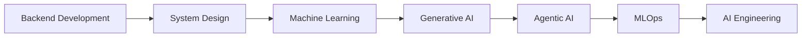

<div align="center">


[](https://git.io/typing-svg)

<p>
  
  
  
  
</p>

</div>

---

## 🧠 About Me

```bash
> whoami
Pranay Bhoir

> role --list
- Backend Developer
- AI/ML Engineer in Progress
- FastAPI Developer
- Node.js Developer

> goal --current
Become a production-grade AI Engineer who builds scalable backend systems,
intelligent agents, RAG applications, and ML-powered products.
```

---

## 🛰️ Developer Dashboard

```text
╔══════════════════════════════════════════════════════════════════════════════╗
║ SYSTEM: PRANAY_CORE                                                        ║
╠══════════════════════════════════════════════════════════════════════════════╣
║ CURRENT_FOCUS     : Backend + AI workflows + production-ready architecture  ║
║ LEARNING_ROADMAP  : FastAPI → ML → LLM Apps → RAG → Agents → MLOps         ║
║ SYSTEM_STATUS     : ONLINE | BUILDING | ITERATING | SHIPPING                ║
║ MISSION_STATEMENT : Build intelligent, scalable, reliable software systems  ║
╚══════════════════════════════════════════════════════════════════════════════╝
```

### ⚙️ Tech Arsenal

<p>
  
</p>

### 🤖 AI Stack

<p>
  
  
  
  
  
  
  
  
  
</p>

---

## 🚀 Featured Projects

<table>
  <tr>
    <td width="33%">
      <h3 align="center">🧩 NeuralOps AI</h3>
      <p align="center">
        
      </p>
      <p>
        Production-grade AI platform featuring AI agents, RAG pipelines, observability, monitoring,
        LLM workflows, and enterprise architecture.
      </p>
      <p>
        
        
        
        
        
      </p>
      <p><b>Metrics:</b> Agents ⚡ | RAG Pipelines 📚 | Observability 📈</p>
      <p><b>Status:</b> </p>
    </td>
    <td width="33%">
      <h3 align="center">🏫 AIML Department Website</h3>
      <p align="center">
        
      </p>
      <p>
        Complete academic department management platform with admin dashboard, event management,
        academics section, notices, Cloudinary integration, and dynamic content management.
      </p>
      <p>
        
        
        
        
      </p>
      <p><b>Metrics:</b> Admin Modules 🛠️ | Dynamic Content 📰 | Events 📅</p>
      <p><b>Status:</b> </p>
    </td>
    <td width="33%">
      <h3 align="center">🌆 Kharka Mumbai</h3>
      <p align="center">
        
      </p>
      <p>
        Intelligent tourism and recommendation platform focused on discovering places, experiences,
        and travel insights around Mumbai.
      </p>
      <p>
        
        
        
      </p>
      <p><b>Metrics:</b> Recommendations 🎯 | Places Indexed 🗺️ | Insights 🧠</p>
      <p><b>Status:</b> </p>
    </td>
  </tr>
</table>

---

## 📊 GitHub Analytics

<div align="center">
  
  
</div>

<div align="center">
  
  
</div>

<div align="center">
  
</div>

<div align="center">
  
</div>

<div align="center">
  
</div>

---

## 🛤️ AI Engineer Journey



### Progress Matrix

```text
Backend Development  [███████████░░░░░░] 65%
System Design        [█████████░░░░░░░░] 55%
Machine Learning     [████████░░░░░░░░░] 50%
Generative AI        [███████░░░░░░░░░░] 45%
Agentic AI           [██████░░░░░░░░░░░] 40%
MLOps                [█████░░░░░░░░░░░░] 35%
AI Engineering       [████░░░░░░░░░░░░░] 30%
```

---

## 🧪 Live System Signals

```bash
pranay@ai-dashboard:~$ systemctl status pranay-engineering
● pranay-engineering.service - BUILD • SCALE • AUTOMATE • INTELLIGENCE
   Loaded: loaded (/etc/systemd/system/pranay-engineering.service; enabled)
   Active: active (running) since always
   Process: shipping high-impact products and open-source contributions
```

<div align="center">
  
  
  
  
</div>

---

<div align="center">
  <h3>BUILD • SCALE • AUTOMATE • INTELLIGENCE</h3>
  
</div>